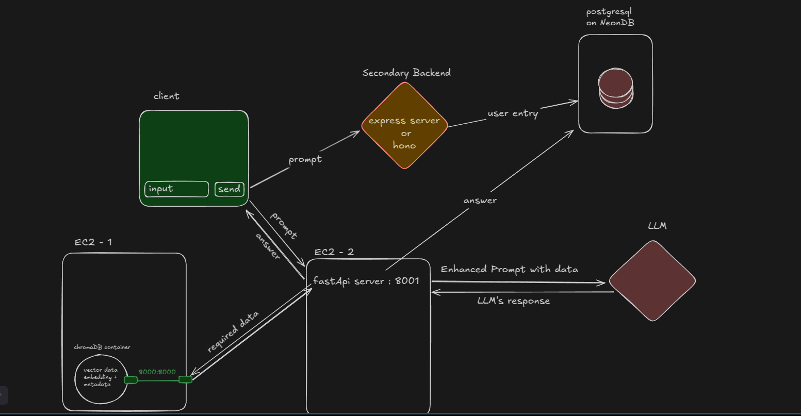

# Turtle-justice

Turtle justice is an AI based solution for slow and improper justice system of Nepal . Main components of this project includes RAG which contains  legal documents , constitution of Nepal , judgements , case summaries , court record , it also contains data which we got by interviewing advocates , judges 

## Architecture of Turtle justice 

## Setting up locally 
Look into individual folder's readme.md to set the project locally 
